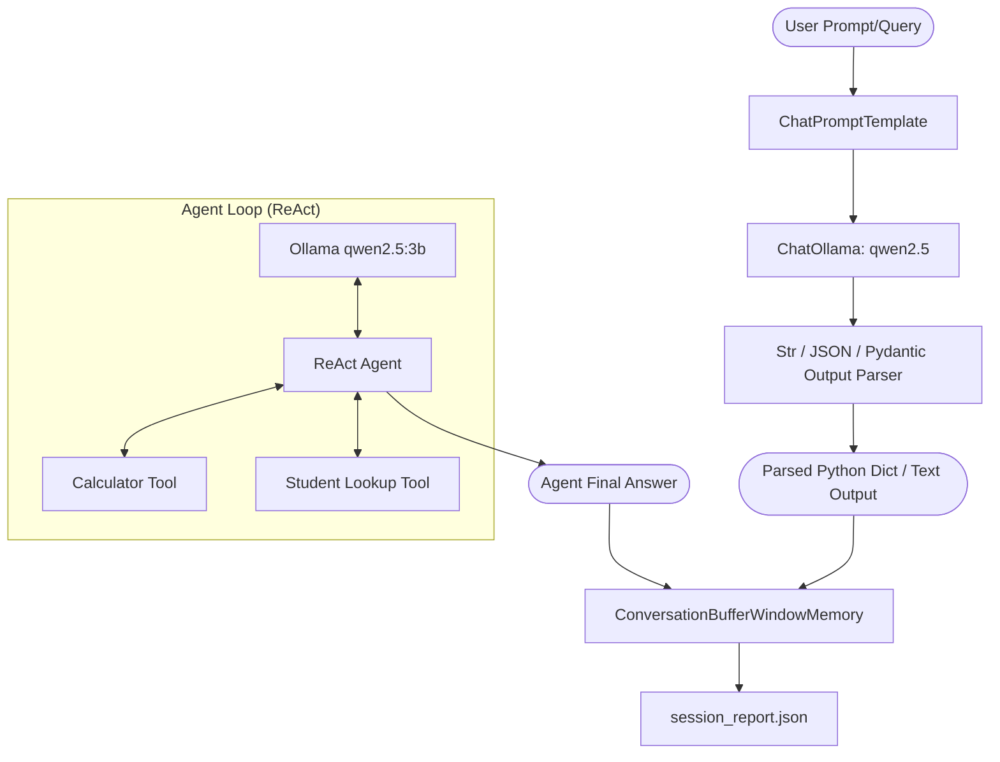

# 🚀 Ollama LangChain Model Playground

[](https://www.python.org/)
[](https://github.com/langchain-ai/langchain)
[](https://ollama.com/)
[](https://opensource.org/licenses/MIT)

A powerful, light-weight, local-first LLM development framework built with **LangChain** and **Ollama**. This repository provides an end-to-end playground demonstrating advanced LangChain features: LangChain Expression Language (LCEL), structured JSON extraction with Pydantic, custom tools execution via ReAct agents, and session memory reporting.

All models run **locally** on your machine—no API keys or external cloud server calls required.

---

## 🗺️ System Architecture & Workflow

Here is how the components in this workspace connect to form a cohesive AI pipeline:



---

## ✨ Key Features

- **Local LLM Integration:** Uses `ChatOllama` to invoke local lightweight models (`qwen2.5:0.5b` for fast chains and `qwen2.5:3b` for complex ReAct agent logic).
- **LCEL (LangChain Expression Language):** Standardized chaining of Prompts, Models, and Output Parsers with native support for `invoke()`, streaming (`stream()`), and concurrent batch processing (`batch()`).
- **Structured JSON Parsing:** Leverages Pydantic's `BaseModel` schema with `JsonOutputParser` to guarantee structured responses from local models.
- **Custom Tool Integration:** Extends LLM capabilities with python-powered custom tools (e.g., safe math evaluations and memory database lookups).
- **Autonomous ReAct Agent:** Employs a Zero-Shot ReAct agent capable of parsing inputs, choosing the correct tool, and combining results to solve complex multi-step queries.
- **Session Memory & Export:** Utilizes windowed memory buffers (`ConversationBufferWindowMemory`) to keep track of conversations and export them as clean JSON session logs.

---

## 📁 Repository Structure

Below are the primary files in the workspace:

- 📄 **`model.py`** - A simple starter script to verify Ollama connectivity and basic LLM invocation.
- 📄 **`prompttemplates.py`** - Demonstrates configuring reusable chat templates with dynamic inputs.
- 📄 **`icel.py`** - Showcases the power of LCEL pipelines, demonstrating execution modes (Invoke, Stream, Batch) and execution time benchmarks.
- 📄 **`parsers.py`** - Extracts structured student profiles into clean Python dicts using Pydantic validation.
- 📄 **`customtools.py`** - Builds calculator & lookup tools, and bundles them into an interactive Zero-Shot ReAct Agent.
- 📄 **`report.py`** - Stores conversational context in memory and persists session logs to a JSON file.
- 📁 **`love/`** - A helper directory containing auxiliary testing files (`love.py`).

---

## ⚡ Getting Started

### 1. Prerequisites

Ensure you have [Ollama](https://ollama.com/) installed and running on your system.

Pull the models used in this playground:
```bash
# Lightweight model for chains and parsing
ollama pull qwen2.5:0.5b

# Larger model for agent reasoning and tool usage
ollama pull qwen2.5:3b
```

### 2. Installation

Clone the repository and set up a virtual environment:

```bash
# Clone the repository
git clone https://github.com/munni036/langchainmodel.git
cd langchainmodel

# Create a virtual environment
python -m venv venv

# Activate the virtual environment
# On Windows:
.\venv\Scripts\Activate.ps1
# On macOS/Linux:
source venv/bin/activate

# Install dependencies
pip install -r requirements.txt
```

---

## 🛠️ Usage Examples & Code Demos

### A. Basic LLM Invocation
Execute a quick check on the local LLM:
```bash
python model.py
```
*Behind the scenes in `model.py`:*
```python
from langchain_ollama import ChatOllama
llm = ChatOllama(model="qwen2.5:0.5b", temperature=0)
response = llm.invoke("What is an AI Agent?")
print(response.content)
```

### B. Chaining & Streaming with LCEL
Run structured prompt chains, stream responses token-by-token, and run concurrent batch processing:
```bash
python icel.py
```

### C. Structured JSON Extraction
Extract raw unstructured strings into verified JSON objects matching a strict Pydantic model:
```bash
python parsers.py
```

### D. Multi-Step ReAct Agent
Run an agent that automatically reasons which tools to use to solve a query:
```bash
python customtools.py
```
*Example input:* `"What is Priya's CGPA and 15% of it?"`
*Agent workflow:*
1. Resolves Priya's record via `student_lookup(name="Priya")` $\rightarrow$ `CGPA: 9.1`
2. Calculates `15% of 9.1` via `calculator(expression="9.1 * 0.15")` $\rightarrow$ `1.365`
3. Returns final synthesized response to user.

### E. Session Logging & Export
Run the session reporting script to simulate a chat history log export:
```bash
python report.py
```
This writes a clean history to `session_report.json`:
```json
[
  {
    "role": "human",
    "content": "Look up Priya"
  },
  {
    "role": "ai",
    "content": "Priya is in Cyber Security. CGPA: 9.1. Risk: Low."
  }
]
```

---

## 📝 Dependencies

The framework uses pinned, robust package versions located in `requirements.txt`:
* `langchain==0.2.16`
* `langchain-core==0.2.38`
* `langchain-community==0.2.16`
* `langchain-ollama==0.1.3`
* `pydantic==2.8.2`

---

## 🤝 Contributing

Contributions, issues, and feature requests are welcome! Feel free to open issues or submit pull requests to extend this local AI playground.

---

*Made with ❤️ for local-first AI development.*
